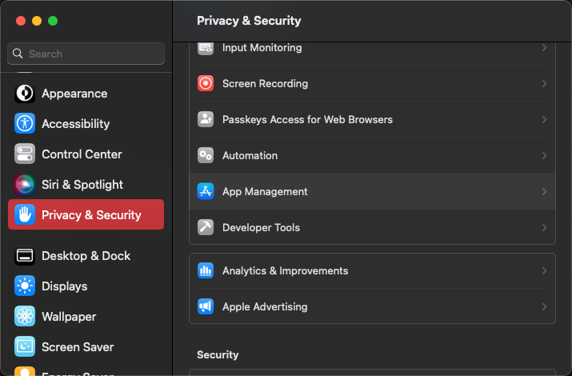
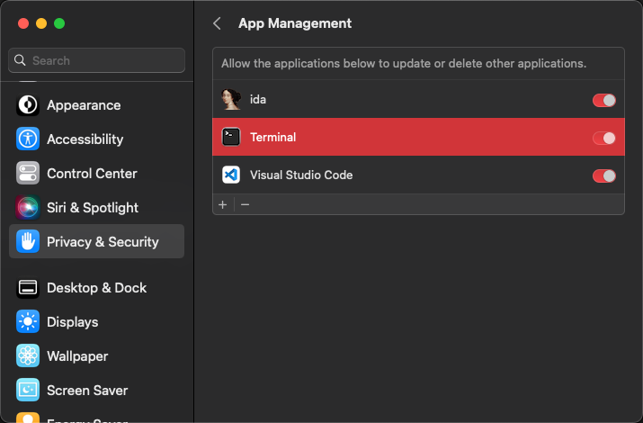

# CC patch

[中文](./README.zh_CN.md)

## Not work

* Acrobat

## Depend

* macOS
  * curl
  * python3
  * Command Line Tools (Install using: `xcode-select --install`)

* Windows
  * PowerShell (Administrator)

## Run

* macOS

      sudo python3 -c "$(curl -fsSL https://raw.githubusercontent.com/YJBeetle/ccpatch/generic/run.py)"

* Windows

      powershell -nop -c "iex(New-Object Net.WebClient).DownloadString('https://raw.githubusercontent.com/YJBeetle/ccpatch/generic/run.ps1')"

## Restore

* macOS

      sudo python3 -c "$(curl -fsSL https://raw.githubusercontent.com/YJBeetle/ccpatch/generic/run.py)" restore

* Windows

      powershell -nop -c "icm -ScriptBlock ([ScriptBlock]::Create((New-Object Net.WebClient).DownloadString('https://raw.githubusercontent.com/YJBeetle/ccpatch/generic/run.ps1'))) -ArgumentList restore"

## Common problem

### MacOS permission issues

Open `System Settings` -> `Privacy & Security` -> `App Management`

Find `Terminal` and turn on

