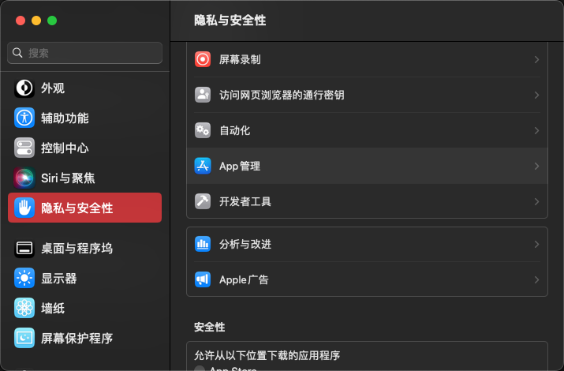

# CC patch

## 不工作

* Acrobat

## 依赖

* macOS
  * curl
  * python3
  * Command Line Tools (执行安装: `xcode-select --install`)

* Windows
  * PowerShell (管理员)

## 执行

* macOS

      sudo python3 -c "$(curl -fsSL https://raw.githubusercontent.com/YJBeetle/ccpatch/generic/run.py)"

* Windows

      powershell -nop -c "iex(New-Object Net.WebClient).DownloadString('https://raw.githubusercontent.com/YJBeetle/ccpatch/generic/run.ps1')"

## 还原

* macOS

      sudo python3 -c "$(curl -fsSL https://raw.githubusercontent.com/YJBeetle/ccpatch/generic/run.py)" restore

* Windows

      powershell -nop -c "icm -ScriptBlock ([ScriptBlock]::Create((New-Object Net.WebClient).DownloadString('https://raw.githubusercontent.com/YJBeetle/ccpatch/generic/run.ps1'))) -ArgumentList restore"

## 常见问题

### MacOS权限问题

打开 `系统设置` -> `隐私与安全性` -> `App管理`

找到 `终端` 并打开

